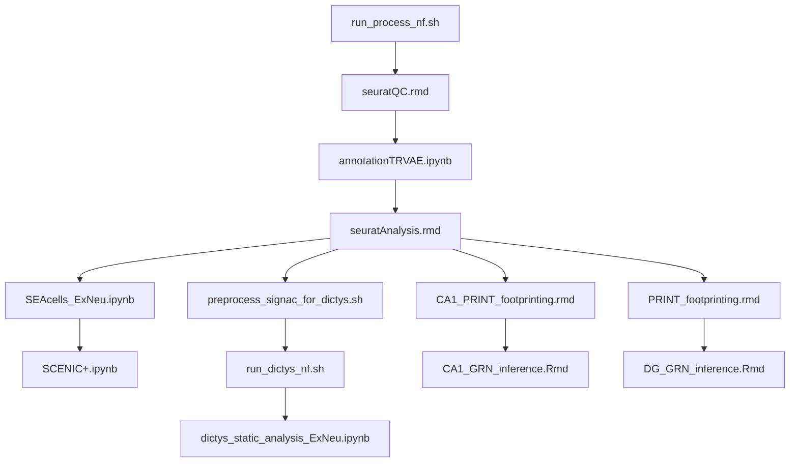

# README

This repository contains the code used to produce the thesis of Andrew C Graham. The code is organized into several scripts and notebooks that should be run in a specific order to reproduce the results presented in the thesis. Data files will be released upon publication of this work, until that time this repository serves to provide insight into the computational methods and approaches used to generate the thesis.

## Folder Structure

- `scripts/`: Contains scripts for data analysis.
- `data/`: Contains raw and processed data files. (Data will become available upon publication of this work)

## File Run Order

The multiome analysis files were run in the following order:

1. `scripts/multiome/bash/run_process_nf.sh` - Process multiome data from raw reads to RNA and ATAC count matrices for each sample (using cellranger-arc), corrected for ambient RNA contamination with cellbender.
2. `scripts/multiome/R/seurat_QC.rmd` - Basic QC and consensus clustering of scMultiome Data
3. `scripts/multiome/python/annotation_TRVAE.ipynb` - Annotation of scMultiome Data using Allen Brain atlas reference dataset
4. `scripts/multiome/R/seurat_analysis.rmd` - In depth analysis of different celltypes
5. `scripts/multiome/R/PRINT_footprinting.rmd` - Footprinting analysis of DG granule cells, required for GRN inference
6. `scripts/multiome/R/CA1_PRINT_footprinting.rmd` - Footprinting analysis of CA1 pyramidal neurons, required for GRN inference
7. `scripts/multiome/R/CA1_GRN_inference.Rmd` - GRN inference of CA1 pyramidal neurons
8. `scripts/multiome/R/DG_GRN_inference.Rmd` - GRN inference of DG granule cells
9. `scripts/multiome/python/SEAcells_ExNeu.ipynb` - Computation of meta SEAcells to aid SCENIC+ analysis
10. `scripts/multiome/python/SCENIC+_ExNeu.ipynb` - GRN inference with SCENIC+
11. `scripts/multiome/bash/preprocess_signac_for_dictys.sh` - Prepare data for GRN inference with dictys
12. `scripts/multiome/nf/run_dictys_nf.sh` - GRN inference with dictys
13. `scripts/multiome/python/dictys_static_analysis_ExNeu.ipynb` - Interactive analysis of GRNs infered with dictys

Statistical analysis of imaging results is in file `scripts/imaging/imaging_analysis.rmd`.

Statistical analysis of behavioural test results is in file `scripts/behaviour/behaviour_analysis.rmd`.

## Data Availability

The data used in this analysis will become available upon the publication of this work. 

For any questions or issues, please contact Andrew C Graham.
