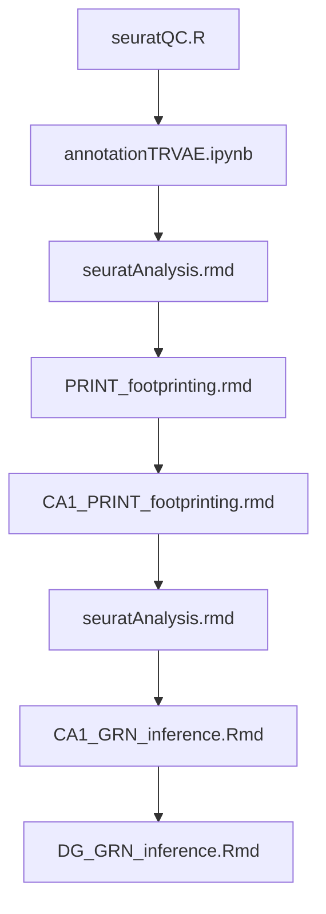

# README

This repository contains the code used to produce the thesis of Andrew C Graham. The code is organized into several scripts and notebooks that should be run in a specific order to reproduce the results presented in the thesis.

## Folder Structure

- `data/`: Contains raw and processed data files. (Data will become available upon publication of this work)
- `scripts/`: Contains R and Python scripts for data analysis.

## File Run Order

To reproduce the analysis, run the files in the following order:

1. `scripts/multiome/R/seuratQC.R`
2. `scripts/multiome/python/annotationTRVAE.ipynb`
3. `scripts/multiome/R/seuratAnalysis.rmd`
4. `scripts/multiome/R/PRINT_footprinting.rmd`
5. `scripts/multiome/R/CA1_PRINT_footprinting.rmd`
6. `scripts/multiome/R/seuratAnalysis.rmd`
7. `scripts/multiome/R/CA1_GRN_inference.Rmd`
8. `scripts/multiome/R/DG_GRN_inference.Rmd`

## DAG Diagram

Below is a Directed Acyclic Graph (DAG) representing the file run structure:

## Data Availability

The data used in this analysis will become available upon the publication of this work. Please check back for updates.

For any questions or issues, please contact Andrew C Graham.
